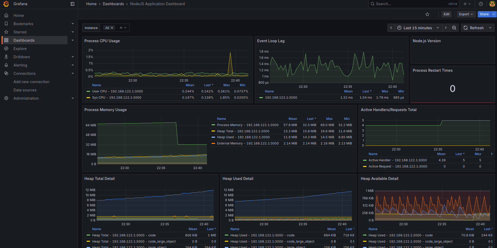
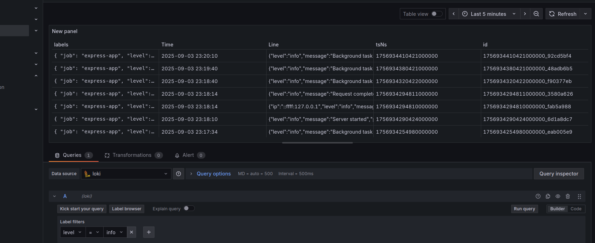

# Integrated Monitoring System with Grafana, Loki, Prometheus & Node.js

A comprehensive monitoring solution that combines performance metrics collection, centralized logging, and real-time dashboards. This setup demonstrates how to monitor a Node.js application using industry-standard observability tools.

## What This Does

I created this integrated monitoring stack to showcase complete application observability. The system collects performance metrics via Prometheus, aggregates logs through Loki, and visualizes everything in Grafana dashboards. You'll be able to monitor your Node.js app's health, track API response times, view error rates, and search through centralized logs all in one place.

## Prerequisites

- Docker & Docker Compose
- Node.js
- npm 
- Basic understanding of monitoring concepts

## Quick Start

1. **Clone and setup the Node.js application:**
```bash
npm install
npm run build
```

2. **Start the monitoring stack:**
```bash
docker-compose up -d
```

3. **Deploy the Node.js application:**
```bash
npm start
```

4. **Generate some traffic:**
```bash
curl http://localhost:3000/api/health
curl http://localhost:3000/api/users
curl http://localhost:3000/api/metrics
```

## How to See It Working

1. **Access Grafana Dashboard:** `http://localhost:3001` (admin/admin)
2. **View Prometheus Metrics:** `http://localhost:9090`
3. **Check Application Logs:** Search in Grafana's Explore section with Loki
4. **Monitor Real-time:** Watch metrics update as you interact with the app

## Architecture Components

### Prometheus Setup
- Scrapes metrics from Node.js app every 15 seconds
- Stores time-series data for performance analysis
- Configured with custom recording rules

## Node.js Application Features

- **Health Check Endpoint:** `/api/health`
- **Custom Metrics:** Request duration, error rates, active connections
- **Structured Logging:** JSON format with correlation IDs
- **Performance Monitoring:** Memory usage, CPU metrics, response times

## Monitoring Dashboards





## Testing the System

1. **Load Testing:**
```bash
npm run load-test
```

2. **Error Simulation:**
```bash
curl http://localhost:3000/api/error-test
```

## Cleanup

```bash
docker-compose down -v
docker system prune -f
npm run clean
```


Thanks for exploring this monitoring solution!
